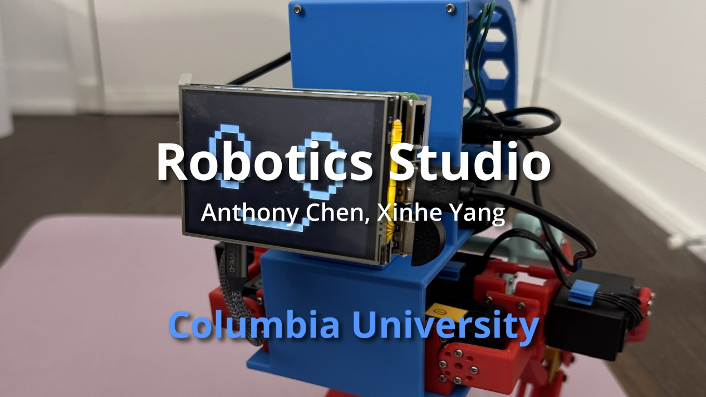
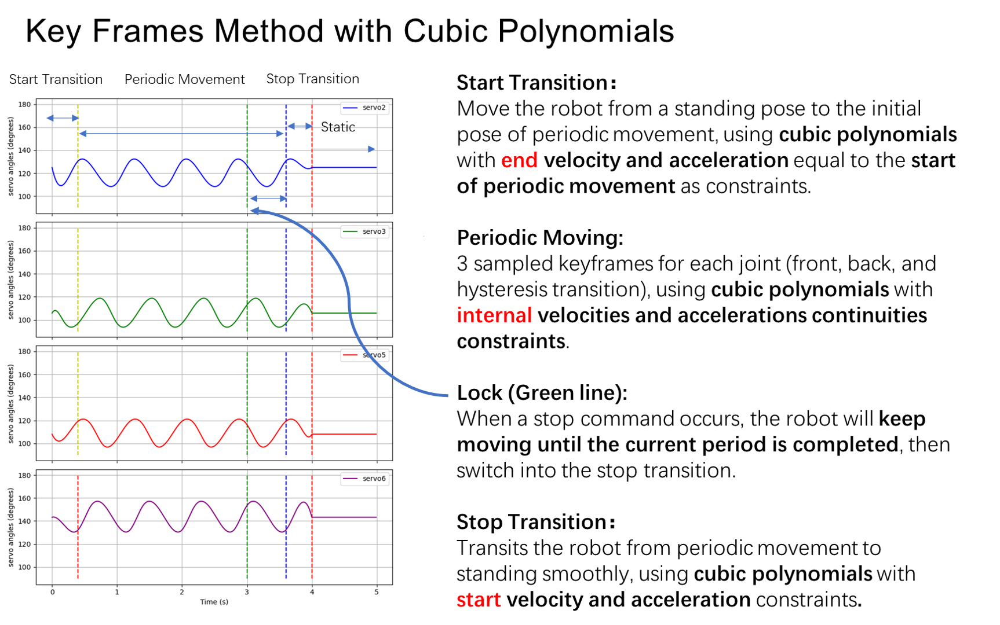
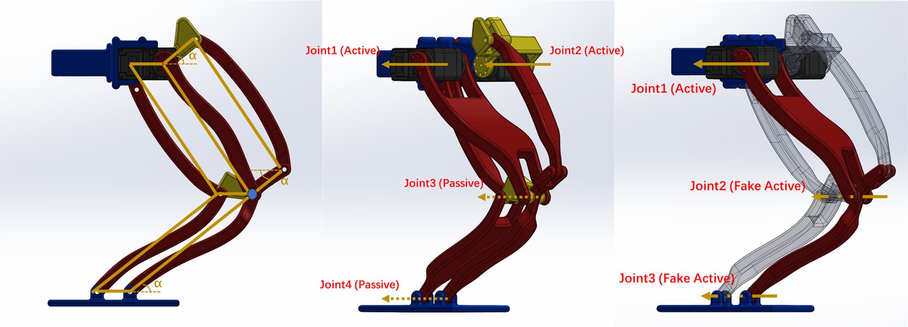

# Robot Studio: Bipeda Robot Full Project Implementation  
It is a bipedal robot implementation for Columbia MECE 4611 Robotics Studio created by ***Zewen "Anthony" Chen*** and ***Xinhe "Carl" Yang*** (Fall 2024). We get inspiration by Yuhang Hu's work [CB-20](https://www.youtube.com/watch?v=Y0fBdpLf9ZI&t=1s) and redesign it.

---

### Say Beforehand

For those who attend Robotics Studio in the future or want to build their own first bipedal robot, I hope this implementation can help you. But remember, it is far from perfect. Here are drawbacks and suggestions for improvement:
1. It is relatively heavy, the whole weight reaches close to 1.5 kg. and the weight is not concentrated enough, if you can lighten it and concentrate the mass it should be able to run faster. I think under 1.2kg would be ideal.
2. The fact that we don't have the two motors located in the hip joints due to timing issues results in extra weight. If you can make the most of them, the robot should be able to make more gaits and be more stable.
3. Due to the parallel design of the legs, they are compressed by their own weight and can not be considered as rigid bodies, which makes simulation to reality more difficult, improving the design or replacing the other structures may improve.

<u>**So, do not just copy it, make it better!**</u>  

Best wishes,  
Anthony Chen  

---

### Project Overview

- **Project Video**  
  - [x] Playlist Link: [https://www.youtube.com/playlist?list=PLH_mFWdIEgZGXP19iW7NsymILhA3eG9Pi](https://www.youtube.com/playlist?list=PLH_mFWdIEgZGXP19iW7NsymILhA3eG9Pi)  
  - [x] Journey Video:  
  
[](https://www.youtube.com/watch?v=UUYPjQSJz8M) 

- **CAD**  
  - [x] CAD Link (GrabCAD): [https://grabcad.com/library/robotics-studio-bipedel-robot-1](https://grabcad.com/library/robotics-studio-bipedal-robot-1)  

- **3D Printing**  
  - [x] [STL Files](./3D%20Printing/)  
  - [x] MarkerWorld Link: [https://makerworld.com/zh/models/903789#profileId-863432](https://makerworld.com/zh/models/903789#profileId-863432)  

- **Assembly Guidance**  
  - [x] [Purchase Links for Essential Parts](#purchase-links-for-essential-parts)  
  - [x] [Additional Assembly Information](#additional-assembly-information)
  - [ ] Assembly Video in CAD  
  Probably won't do it anytime soon, I think a good robotics engineer should be capable of analyzing and assembling this robot (or just because I am lazy ╮(╯▽╰)╭). But if enough requests are posted in issues, perhaps I'll make it.

- [**Control**](#control)
  - [x] [Requirements](#requirements)
  - [x] [Testing Code](#testing-code)
  - [x] [Servo Curve Analysis](#servo-curve-analysis)
  - [x] [Integrated Control Code](#integrated-control-code)

- [**Simulation**](#simulation)
  - [x] [Extra Requirements](#extra-requirements)
  - [x] [Equivalent Series Structure Simplification](#equivalent-series-structure-simplification)
  - [x] [STL & URDF](#stl--urdf): 
  [12cm Upeer Legs](./Simulation/model/) 
  [8cm Upeer Legs](./Simulation/model8/)
  - [x] [Simulation Code](#simulation-code)
---
### Assembly Guidance
#### Purchase Links for Essential Parts
- **Amazon**  
  - <u>**7**</u> [LX-16A Serial Bus Servo](https://www.amazon.com/LewanSoul-Real-Time-Feedback-Bearing-Brackets/dp/B0748BQ49M) (Singal Servo)
  - <u>**1**</u> [LX-16A Serial Bus Servo Controller](https://www.amazon.com/LewanSoul-BusLinker-Debug-Board-LX-16A/dp/B073WRLJB2?ref_=ast_sto_dp)
  - [5 Packs LX-16A Serial Bus Servo with Servo Controller Kits](https://www.amazon.com/Hiwonder-LX-16A-Robotic-Controller-Control/dp/B073XY5NT1) (You can buy servos and controller separately or this kit and 2 extra servos.)
  - <u>**1**</u> [Battery Pack](https://www.amazon.com/dp/B01M7Z9Z1N) (You may use any other battery have DC 12V/5V USB dual output.)  
  <u>**Warning</u>: This battery may not be able to afford more than 8 servos.**
  - <u>**1**</u> [DC to DC Converter](https://www.amazon.com/gp/product/B00BYS9JYA)
  - <u>**1**</u> [Raspberry Pi 4](https://www.amazon.com/Raspberry-Model-2019-Quad-Bluetooth/dp/B07TD42S27?th=1)
  - <u>**1**</u> [Micro SD Card ](https://www.amazon.com/dp/B073JWXGNT?th=1)
  - <u>**1**</u> [USB Male to USB C](https://www.amazon.com/Braided-Compatible-Samsung-Portable-Charger/dp/B07HQHL6ZK?th=1)
  - <u>**1**</u> [Raspberry Pi Touch Screen](https://www.amazon.com/dp/B0D4DL38MF?ref=ppx_yo2ov_dt_b_fed_asin_title)  
 <u>**Warning</u>: Please follow the driver installation guidance in the product description to enable it on Raspberry Pi. You may not be able to use  <u>HDMI</u> output if you enable the touchscreen. If the touchscreen does not work, please delete "LCD- show" floder and install it again.**
  - <u>**1**</u> [USB 2.0 Mini Microphone](https://www.amazon.com/dp/B071WH7FC6?ref=ppx_yo2ov_dt_b_fed_asin_title)
  - <u>**1 pkg**</u> [Raspberry Pi 4 Heatsink](https://www.amazon.com/dp/B0963BMGFY?ref=ppx_yo2ov_dt_b_fed_asin_title) (The 4mm-thick heatsink in it is perfectly adapted to the touchscreen.)
  - <u>**1 pkg**</u> [M2 M3  Male Female Hex Brass Standoffs Spacers Screws Nuts Kit](https://www.amazon.com/dp/B06XCNF6HK?ref=ppx_yo2ov_dt_b_fed_asin_title&th=1) (We only use M2 here.)
  - <u>**1 pkg**</u> [M3x6mmx0.5mm Stainless Steel Round Flat Washer](https://www.amazon.com/dp/B015A39NCC?ref=ppx_yo2ov_dt_b_fed_asin_title) (You may use any other 3mm flat washer with aorund 0.5mm thicknesses.)

- **AliExpress**  
  - <u>**8 pcs**</u> [3x16xM2 Shoulder Screw ](https://www.aliexpress.us/item/3256806009271581.html?spm=a2g0o.order_list.order_list_main.10.12f01802Rwg7LO&gatewayAdapt=glo2usa)


- **McMaster**  
  - <u>**1 pkg**</u> [M2 x 0.4 mm Thread, 8 mm Long, Stainless Steel Socket Head Screw](https://www.mcmaster.com/91292A832/)  
  - <u>**1 pkg**</u> [M2 x 0.4 mm Thread, 12 mm Long, Stainless Steel Socket Head Screw](https://www.mcmaster.com/91292A834/)  
  - <u>**2 pkg**</u> [for Plastic, 18-8 Stainless Steel, M2.2 Screw Size, 8 mm Long, Phillips Rounded Head Thread-Forming Screws](https://www.mcmaster.com/99461A922/)  
  - <u>**1 pkg**</u> [for M2 Screw Size, Standard, 2.4 mm ID, 4.4 mm OD, 18-8 Stainless Steel Split Lock Washer](https://www.mcmaster.com/92148A050/)  
  - <u>**1 pkg**</u> [Medium-Strength, Class 8, M2 x 0.4 mm Thread, Zinc-Plated Steel Hex Nut](https://www.mcmaster.com/90591A265/)  
  - <u>**1 pkg**</u> [M2 x 0.4 mm Thread Size, 2.9 mm Installed Length, Brass Tapered Heat-Set Inserts for Plastic](https://www.mcmaster.com/94180A307/)  
  - <u>**4 pcs**</u> [3 mm Shoulder Diameter, 25 mm Shoulder Length, M2 x 0.4 mm Thread Alloy Steel Shoulder Screws](https://www.mcmaster.com/92981A775/)  
#### Additional Assembly Information 
  - For 3D-printed ***"Robot_Cover"*** part, you need to do **thermal insert** through the soldering iron.
  - For ***"Cylinder_Pi"*** and ***"Cylinder_DC_Converter"*** parts in CAD, **do not 3D print it**, use [M2 studs](https://www.amazon.com/dp/B06XCNF6HK?ref=ppx_yo2ov_dt_b_fed_asin_title&th=1) above instead. I have tried 3D print studs with thermal inserts but failed, that's why they are not included in 3D Printing files.
  - In Solidworks CAD, you may see **Internal-Tooth Lock Washer** for mating convenience in Solidworks. However, you can use other less damaging lock washers like [Split Lock Washer](https://www.mcmaster.com/92148A050/) instead.
  - For ***"Raspberry_Pi_Platform"*** part, you can use **laser cut acrylic sheets** to get it instead of 3D printing
  - Although the screws that connect the ***"Raspberry Pi"***, the ***"Raspberry_Pi_Platform"***, the ***"Servo_Connector_Head"***, and the ***"studs that hold the DC converter"*** in place in CAD do not use a **lock washer,** it is highly recommended that you use one in order to prevent parts from falling out of place during the robot's motion.
  - **Very Important!** Make sure you print two legs using **same filaments**, or the robot might hard to balance (like [this](https://youtu.be/c0_l959v7TQ?si=rPd1EVJWCl6EjpbT)).
  - Although the 8cm shorter upper legs are included in this project and the [simulation](https://youtu.be/Yh0ZwXFP5J8?si=DioH9wF-7lgsMUER) shows it somehow better, I failed to make the robot walk using them. But, you can try.
---

### Control  
#### Requirements
 - Python 3.10.15+ (To install PyLX-16A package, you must use a Python environment with 3.10 or newer version.)
 - [PyLX-16A](https://github.com/ethanlipson/PyLX-16A/tree/master) 
 - Numpy 2.1.3+
 - Pyserial 3.5+
 - PyQt6 6.7.1+ (for visual debugging on windows, **cannot process on RasoberryPi**)
 - SpeechRecognition (for voice recognition)
 - Pygame (for screen facial expression)
#### Testing Code
 - [**servo-test.py**](./Control/servo-test.py)  
    Visualized servo adjusting code.
 - [**test_hello-world.py**](./Control/test_hello-world.py)  
    3 servos sinusoidal testing code.
#### Servo Curve Analysis
 - [**servo_curve_visualization.py**](./Control/servo_curve_visualization.py)  
    By setting the walk period and servo keyframes, you can plot the servo angle curves of preparation phase, periodic walk phase, and stop phase obtained by cubic polynomial interpolation. Accordingly you can check the servos for excessive overshooting and thus avoid violent shaking or damage to the robot. 

The robot in this project uses a keyframe + cubic polynomial interpolation approach for periodic gait planning, taking into account the smooth transitions required for start and termination. This formula ensures continuity of servo position, velocity and acceleration throughout the robot's travel. A simple explanation of the idea is shown in the figure below:

For this project I used a system of linear equations to solve for multiple cubic polynomial coefficients simultaneously, which you should be familiar with if you also took the MECS 4603 AppliedRobotics: Algorithm & Software course.
#### Integrated Control Code
The integration control code is essentially designed to run on a Raspberry Pi although it can also be used by connecting the servo controller usb cable to a computer. Therefore, before you use this integrated control code, **it is highly recommended that you learn how to control the Raspberry Pi wirelessly using Remote Desktop.** You can follow this video 👉 [Raspberry Pi Headless Setup](https://youtu.be/dhY8m_Eg5iU?si=XMZ2caKZ6iJjB2I0) to install xrdp on Raspberry Pi and use **Windows Remote Connection** on the laptop.

 - [**Robot.py**](./Control/Robot.py)  

This integrated control code is used to provide basic control of the project's bipedal robot. It includes the following main functions:  
1. wake up the robot, control the robot to switch between homing and standing poses
2. Nodding and Squatting
3. Cyclic walking using a cubic polynomial with smooth transitions for starting and stopping.
4. Control the robot using terminal input or voice (microphone required).
5. Display corresponding facial expressions on the Raspberry Pi touchscreen according to different commands.
6. Periodic servo health check (position, temperature, voltage).  
    
**Caution**: 
- Since voice input has only been tested on the Raspberry Pi, there is no guarantee that this feature will work properly when connected to a computer.
- The servo angles in the code are intended to be applied to the original size (12cm) upper leg, if you plan to use a shorter 8cm upper leg, please re-measure the servo angle.

**Warning**: 
- Since the facial expressions was originally intended to be on a Raspberry Pi touchscreen, pygame's output screen number is specified as 0. However, if you use Remote Desktop to launch the Facial Expression feature on a Raspberry Pi **without** connecting a touchscreen, the Facial Expression display may be redirected to the Remote Desktop and paralyze it. Therefore, please disable this funtion when you are not using a touchscreen on your robot.
    ```
    robot = Robot(7, 'keyboard', False)
    ```
---
### Simulation  
#### Extra Requirements
 - Visual Studio 2022+ (for supporting pybullet simulation)
 - Pybullet 3.2.6+ (for simulation)
#### Equivalent Series Structure Simplification

The top left image shows the parallel linkage structure of the legs, where the robot's legs actually consist of three parallelograms. The three pinch angles shown in the image are equal in degrees.
Thus, we can simplify the original active and multiple passive joints shown in the center image above to the tandem structure shown in the right image above (the translucent parts are suppressed).
The joint angle Equivalent Series Structure Simplification has following relationship:
- Joint1(Active) remains unchanged.
- Joint2(Fake Active) equals original Joint2(Active).
- Joint3(Fake Active) equals to the negative of Joint1(Active)+Joint2(Fake Active), which mimics the original parallel construction making the foot always parallel to the base.
#### STL & URDF
- In the "Simulation" folder, I provide 2 URDF files and the associated STL files. The "model" folder is for the original size upper leg (12cm) and the "model8" folder is for the short upper leg (8cm). 
- In URDF, for the inertial parameter part of the connecting rod, the weight was measured by weighing each part individually on an electronic scale with an accuracy of 1g, and the center of mass and inertia were measured by using Mass Properties in the Solidworks Evaluate option. Due to possible variations in the print material, I recommend that you reweigh the individual parts of your robot.
- You can see my definition of the coordinate system and key rotation axes in the SLDASM assembly files with "for_simulation" suffixes in [GrabCAD](https://grabcad.com/library/robotics-studio-bipedal-robot-1) .
#### Simulation Code
In all simulation codes, models of different lengths of upper legs were loaded by
original size (12cm):
```
robotId = p.loadURDF("model\myrobot_series.urdf",robotStartPos, robotStartOrientation,useFixedBase=False)
```
short size (8cm):
```
robotId = p.loadURDF("model8\myrobot_series.urdf",robotStartPos, robotStartOrientation,useFixedBase=False)
```
In Pybullet, you can use **ctrl+left mouse button** to rotate the view or **ctrl+middle mouse button** to pan the view. Also, if you want to fix the robot in the air for further observation, please make the following settings:
```
robotId = p.loadURDF("model\myrobot_series.urdf",robotStartPos, robotStartOrientation,useFixedBase=True)
```
 - [**basic_simu.py**](./Simulation/basic_simu.py)
 The code provides the most basic simulation functionality for loading the ground with robots.
 - [**sin_walk.py**](./Simulation/sin_walk.py)
 This code provides the ability to drive the robot to walk using a single sinusoidal curve, which will output the average linear velocity at the endpoints.
 - [**cubic_walk.py**](./Simulation/cubic_walk.py)
 This code provides the ability to drive the robot to walk using the same cubic polynomial curve as in the control code, and will output the average line speed at the terminal.
 - [**jump.py**](./Simulation/jump.py)
 The code provides the ability to drive a robot to jump using an unequal amplitude sinusoidal signal, which works better in the short upper legs model.